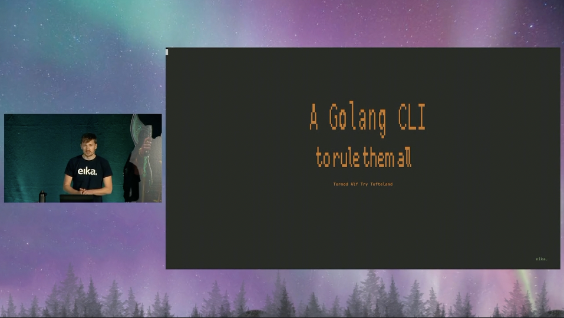

# A Golang CLI to rule them all

This is a repo for the [slides](./golang-cli.md) and the code that were showed at the presentation with the same title at the JavaZone conference in Norway in 2021

Video recording:

# Learn Go

If your're new to Go, check out: [A Tour of Go](https://go.dev/tour)

If you have some experience, [Effective go](https://go.dev/doc/effective_go) is a good read, if you haven't read it already.

For more resources, see [The offical doc page](https://go.dev/doc/)
